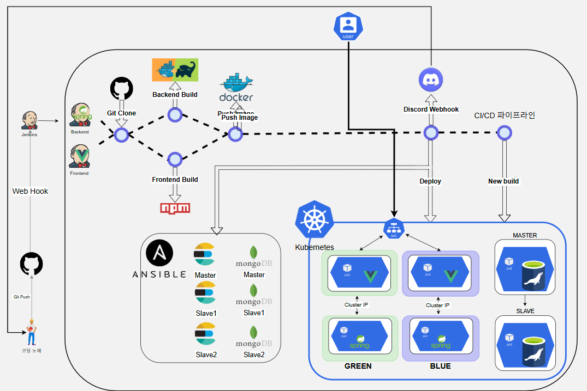

# be12-4th-404Error-EduLink

## 📌 프로젝트 주제 
### EduLink: 혁신적인 학습 관리 플랫폼

      

[프로젝트 개요 보기](https://github.com/beyond-sw-camp/be12-4th-404Error-EduLink/wiki/1.-%ED%94%84%EB%A1%9C%EC%A0%9D%ED%8A%B8-%EA%B0%9C%EC%9A%94)

### 프로젝트 목표
- EduLink 서비스에서 Jenkins, Kubernetes, Ansible을 활용하여 코드 변경부터 배포까지의 CI/CD 프로세스를 자동화하고, 블루/그린 배포 방식을 통해 무중단 배포를 실현합니다.
- Ansible을 이용해 Elasticsearch와 MongoDB의 설치 및 관리를 자동화함으로써 일관된 환경을 유지하고 운영 효율성을 높이는 것을 목표로 합니다.
- 디스코드 알림과 빠른 롤백 메커니즘을 도입하여 시스템 안정성을 보장하고 사용자 경험을 지속적으로 유지하는 데 중점을 둡니다.

## 💡팀

    
    <h3>한화시스템 BEYOND SW캠프 </h3>
    
12기 2차 프로젝트 <strong>팀 404Error</strong>

## 🤚 404Error 팀원

  <table  align="center">
    <tbody>
      <tr>
        <td align="center"><a href="https://github.com/museongkim0" style="text-decoration: none; color: lightgray;"> <b> 🐯 김무성</b></a> </td>
        <td align="center"><a href="https://github.com/kuj7882" style="text-decoration: none; color: lightgray;"> <b> 🐶 김유진</b></a> </td>
        <td align="center"><a href="https://github.com/GoodLeaf" style="text-decoration: none; color: lightgray;"> <b> 🐺 김정엽</b></a> </td>
        <td align="center"><a href="https://github.com/gunha0405" style="text-decoration: none; color: lightgray;"> <b> 🐱 오건하</b></a> </td>
        <td align="center"><a href="https://github.com/leewoojin12" style="text-decoration: none; color: lightgray;"> <b> 🦁 이우진</b></a> </td>
      </tr>
    </tbody>
  </table>

## 🔧 기술 스택

 

 

 
 
 

## 🖥️ 시스템 아키텍쳐

## 🏗️ CI/CD 프로젝트 구성

| **항목**                | **설명**                                                                                             |
|------------------------|-----------------------------------------------------------------------------------------------------|
| **CI/CD 도구**           | **Jenkins**: 코드 푸시 시 자동화된 빌드, 테스트 및 배포 파이프라인을 구축하여 지속적인 통합을 지원.    |
| **배포 및 오케스트레이션** | **Kubernetes (K8S)**: 애플리케이션의 자동 배포, 확장, 관리를 위한 오케스트레이션 플랫폼.             |
| **인프라 자동화**         | **Ansible**: 서버 구성 관리 및 애플리케이션 배포 자동화 도구. 특히, **Elasticsearch**와 **MongoDB**의 설치 및 관리를 자동화. |
| **배포 방식**            | **블루/그린 배포**: 두 개의 환경(블루/그린)을 사용하여 무중단 배포를 지원 |

## ➡️ CI/CD 파이프라인 흐름
### ⚙️ 자동 빌드 및 테스트
- Jenkins는 GitHub에 코드 푸시가 발생하면 자동으로 빌드를 시작합니다.

- Jenkinsfile을 활용해 프로젝트 빌드와 테스트를 실행하며, 지속적인 통합을 지원합니다.

### 📤 배포 자동화
- 빌드가 성공하면 Dockerfile을 활용해 Docker 이미지를 생성하고, **Kubernetes (K8S)**를 통해 새로운 버전을 자동 배포합니다.

- 블루/그린 배포 방식을 적용하여 새로운 버전(그린)으로 트래픽을 전환하며 무중단 배포를 실현하고, 기존 버전(블루)을 유지해 안정성을 보장합니다.

### ⏪ 롤백 및 안정성 유지
- 트래픽 전환 후 문제가 발생하면 즉시 블루 환경으로 롤백할 수 있습니다.
<!-- - Jenkins와 Kubernetes의 모니터링 기능을 통해 배포 상태를 실시간으로 점검하며, 시스템 안정성을 유지합니다. -->

### 📢 모니터링 및 알림
- 빌드 또는 배포 중 오류가 발생하면 Discord로 팀에 즉시 알림을 전송합니다.

- 빠른 대응을 통해 장애 시간을 최소화합니다.

### 📜 파이프라인 관리
- Jenkins Pipeline과 Jenkinsfile을 사용해 빌드, 이미지 생성, 배포, 롤백 과정을 코드로 정의합니다.

- 파이프라인 설정은 Git에 저장되어 변경 이력을 관리하며, 일관성을 유지합니다.

### 🤖 인프라 자동화
- Ansible을 활용해 Elasticsearch와 MongoDB의 설치 및 관리를 자동화합니다.

- 여러 서버에서 동일한 구성을 적용하여 일관된 환경을 유지합니다.

<!-- 1. **Jenkins**: 코드 변경 시 자동으로 빌드, 테스트, 배포를 실행합니다.

2. 빌드 성공 후 **Kubernetes (K8S)**를 통해 새로운 버전을 자동으로 배포하며, **블루/그린 배포** 방식으로 배포됩니다.
   - 새로운 버전(그린) 환경으로 트래픽을 전환하여 무중단 배포를 보장합니다.
   - 트래픽 전환 후 문제가 발생하면 블루 환경으로 롤백할 수 있습니다.
3. **Ansible**을 사용하여 **Elasticsearch** 및 **MongoDB**의 설치 및 관리를 자동화하여 일관된 환경을 유지합니다.
4. 배포 후 **Jenkins**와 **K8S**의 모니터링을 통해 상태를 점검하고, 문제가 발생하면 즉시 롤백하여 시스템 안정성을 유지합니다. -->

<!-- ##  Jenkins 활용 전략

#### 1) 자동 빌드 및 테스트
- **Jenkins**는 GitHub에 코드 푸시 시 자동으로 빌드를 시작하고, **YAML**을 이용해 프로젝트를 빌드합니다

#### 2) 배포 자동화
- 빌드 성공 후, **Docker** 이미지를 생성하고 **Kubernetes**에 자동 배포합니다.
- **블루/그린 배포** 방식으로 무중단 배포를 구현하며, 문제 발생 시 빠르게 롤백 가능합니다.

#### 3) 모니터링 및 알림
- 빌드/배포 중 오류 발생 시 **Discord**로 알림을 팀에게 즉시 연락합니다.

#### 4) Jenkins 파이프라인
- **Jenkins Pipeline**을 사용하여 빌드, 이미지 생성, 배포, 롤백을 코드로 관리합니다.

#### 5) Jenkisfile
- **Jenkinsfile**을 사용하여 CI/CD Pipeline을 코드로 관리하고, 변경 사항을 Git에 저장합니다다 -->

##  JENKINS 사용 이유
<a href="https://github.com/beyond-sw-camp/be12-4th-404Error-EduLink/wiki/2.-%EC%A0%A0%ED%82%A8%EC%8A%A4-%EC%82%AC%EC%9A%A9-%EC%9D%B4%EC%9C%A0">젠킨스 사용 이유</a>

## 🔵🟢 블루 / 그린 배포 사용 이유
<a href="https://github.com/beyond-sw-camp/be12-4th-404Error-EduLink/wiki/3.-%EB%B8%94%EB%A3%A8-%EA%B7%B8%EB%A6%B0-%EB%B0%B0%ED%8F%AC-%EC%82%AC%EC%9A%A9-%EC%9D%B4%EC%9C%A0">블루 / 그린 배포 사용 이유</a>

##  앤서블 사용 이유
<a href="https://github.com/beyond-sw-camp/be12-4th-404Error-EduLink/wiki/4.-%EC%95%A4%EC%84%9C%EB%B8%94-%EC%82%AC%EC%9A%A9-%EC%9D%B4%EC%9C%A0">앤서블 사용 이유</a>

## CI/CD 시나리오

 
1. github에 frontend/dev, backend/dev에 최신 버전 프로젝트를 머지

- 최신 버전 코드를 머지하면 이벤트 발생

 
2. github는 젠킨스에게 webhook을 통해서 젠킨스에게 이벤트 전달

 
3. 젠킨스 마스터가 젠킨스파일의 지정된 역할(front/backend)을 통해 지정된 젠킨스 에이전트에게 수행할 목록 전달

 
4. 젠킨스는 파이프라인에 저장된 절차 실행

- github에서 최신 코드 clone
- 클론된 코드를 기반으로 빌드 작업 수행
   - front: node, npm bulid
   - back: gradle build
- 빌드를 통해 도커 이미지 생성 및 도커 허브에 push

 
5. 쿠버네티스 마스터에 SSH 접속 후 쉘스크립트 실행

- 현재 실행 중인 pod가 blue라면 green으로 디플로이먼트 생성

   - 젠킨스에서 도커 허브에 푸쉬한 이미지로 컨테이너 실행
- rollout명령어를 활용하여 생성한 디플로이먼트내의 프로그램이 정상 작동인지 확인

- 정상 작동중이라면 서비스를 신버전 디플로이먼트의 파드들과 연결하도록 수정

- 구버전 디플로이먼트의 스케일을 0으로 수정

 
6. webhook을 통해 Discode에게 파이프라인 결과 전달

- 젠킨스에 설치한 Discode 플러그인을 통해 파이프라인 제목, 결과, 실행 시간이 담긴 Post를 Discode에 보냄

- Discode봇이 데이터를 받아 지정한 Discode 서버에 실행 결과를 전송

## 🔎 CI/CD 배포 및 테스트 결과

